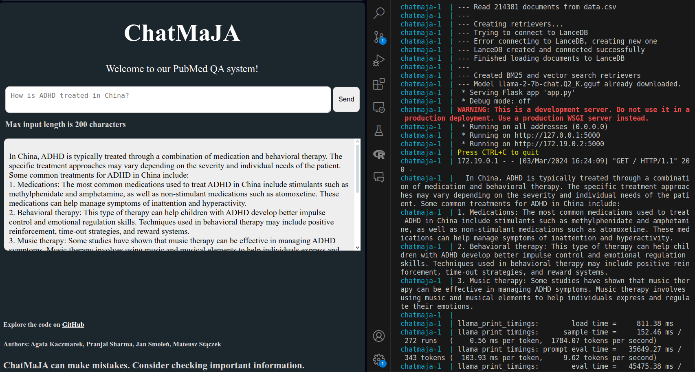

# Docker with Flask UI for our QA system

Our app with Flask UI, in Docker: 
- **works on CPU only** - for better performance and user experience, use UI variant with Gradio in Jupyter Notebook (can be run on Collab with GPU).
- can be accessed at http://localhost:5000/,
- stores models, LanceDB files and original data in Docker volumes.

Other than that, it uses LanceDB and BM25 for retrieval, and [llama-2-7b-chat.Q2_K](https://huggingface.co/TheBloke/Llama-2-7B-Chat-GGUF/blob/main/llama-2-7b-chat.Q2_K.gguf) for generating the answer.

> Please read below about the two CSV files with abstracts that the system can use.

#### Screenshots:

After sending a query, an answer is displayed with basic data about relevant articles which were used to generate the answer. A link directly to PubMed makes it easy to directly open the sources.


Backend logs first show that all 214381 chunks of abstracts were loaded, Flask server was started and the answer was generated.



#### Notes:

Docker image is very large. Even with LLMs and LanceDB stored in mounted volumes. To cache pip environment, a separate image was created, that is built from `Dockerfile.base` file. Building the image for the first takes a long time. Lastly, `llama_cpp_python` is installed without GPU support, but works fine for a small model that we use.

--- 
--- 

## Two version of CSV files

We prepared 2 datasets - one with chunks from 100 abstracts, and the other with chunks from all abstracts. Loading all chunks to LanceDB requires computing embeddings and takes a very long time on CPU and more than 5 minutes on T4 Colab GPU. Either run on a tiny subset of data or download a ready database.

> Options:
> > Update `docker-compose.yml` to use a smaller dataset.
> 
> OR
> 
> > Download and extract a ready LanceDB database `db` folder and place it in the same directory as `docker-compose.yml` - [download link](https://wutwaw-my.sharepoint.com/:f:/g/personal/01151437_pw_edu_pl/EnwtlXrMPApNlDmptSaLnQEBYF_-Bxe7xUs47pqBqQhBYg?e=DCKSDy).

> **For best answers, use all abstracts and download the precomputed LanceDB database.**

--- 
--- 


## How to run - Docker / Docker Compose

> **Note:** commands below assume you're in the directory with the `Dockerfile.base`, `Dockerfile` and `docker-compose.yaml` files.

### The easiest way - Docker Compose

Build an image with the environment and run docker compose up (which automatically will build an image with the app):

```bash
docker build -t chatmaja_base:v1 -f Dockerfile.base .
docker compose up
```

Then, open http://localhost:5000/.

### Longer equivalent - with Docker and Docker Compose

Build images manually, then run Docker Compose

```bash
docker build -t chatmaja_base:v1 -f Dockerfile.base .
docker build -t chatmaja:v1 .
docker compose up
```

Then, open http://localhost:5000/ in a web browser.


### Details and explanations

**Design**: there are 2 separate Dockerfiles to allow for quicker development. First one is only the Python environment, while the other adds our app and starts it. This prevents rebuilding the first image after updating the code.

The `docker compose` builds an image based on the `Dockerfile` in the current directory, tags the image as `chatmaja/v1` and starts a container. It uses an image tagged `chatmaja_base:v1` and that's why we manually built it before. When building an image, you can set different tags with `-t` option. The tag `chatmaja:v1` is just an example. However, you cannot change tag of the base image `chatmaja_base:v1` as it is later used in the file `Dockerfile`.

Port 5000 of the container is mapped to port 5000 of the host, so the app is accessible at http://localhost:5000/.

## Contents:

### app/:
- `app.py` - starting point, Flask app at http://127.0.0.1:5000/
- `qa_pipeline.py` - creates retrievers, download models, has a function to answer queries. This script has the same contents as the Jupyter Notebook with Gradio in the parent directory.
- `templates/` - directory with HTML template for the Flask UI app.

### Docker:
- `requirements.txt` - Python packages installed when building an image with `Dockerfile.base`
- `Dockerfile.base` - builds a base image with all requirements
- `Dockerfile` - to build an image with the app. Requires an image `chatmaja_base:v1` built from `Dockerfile.base`.
- `.dockerignore` - selects file to copy in Dockerfiles.
- `docker-compose.yml` - to build an image with app and start a container with the app. Mounts `./db/` and `./models/` directories to the container. Also, mounts CSV data from a parent directory.

### Docker Compose mounts:
- `models/` - directory where HuggingFace models are stored.
- `db/` - directory where LanceDB data is stored. 
- `../data/preprocessed_data/master_without_embeddings_first_100.csv` - tiny sample CSV to quickly show that our system can answer queries based on the articles. Not used by default (see `docker-compose.yml`).
- `../data/preprocessed_data/master_without_embeddings_all.csv` - CSV used by our app by default (see `docker-compose.yml`). It is recommended to download a precomputed LanceDB database for this file from [here](https://wutwaw-my.sharepoint.com/:f:/g/personal/01151437_pw_edu_pl/EnwtlXrMPApNlDmptSaLnQEBYF_-Bxe7xUs47pqBqQhBYg?e=DCKSDy) (see section above about 2 versions of CSV files).