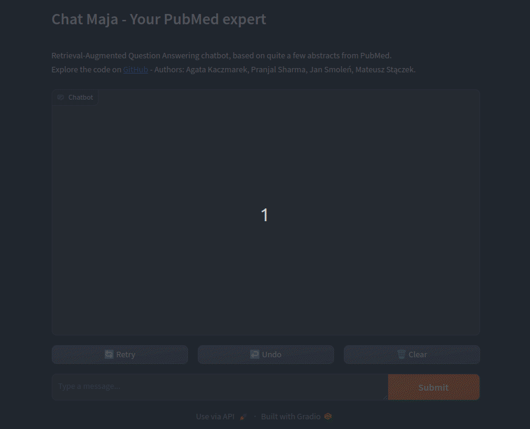
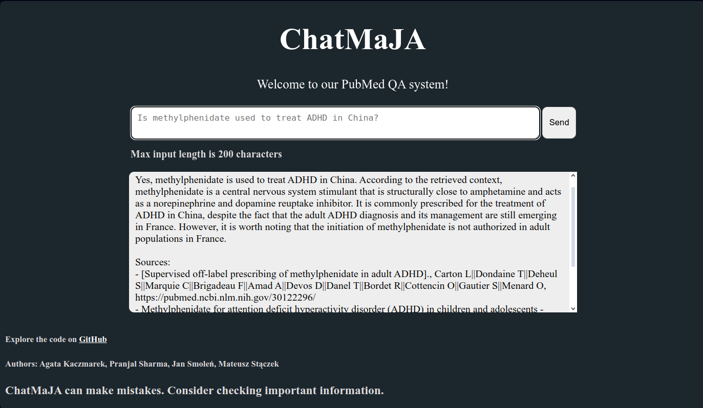
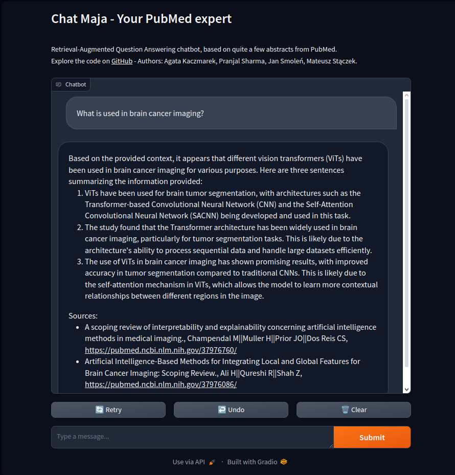
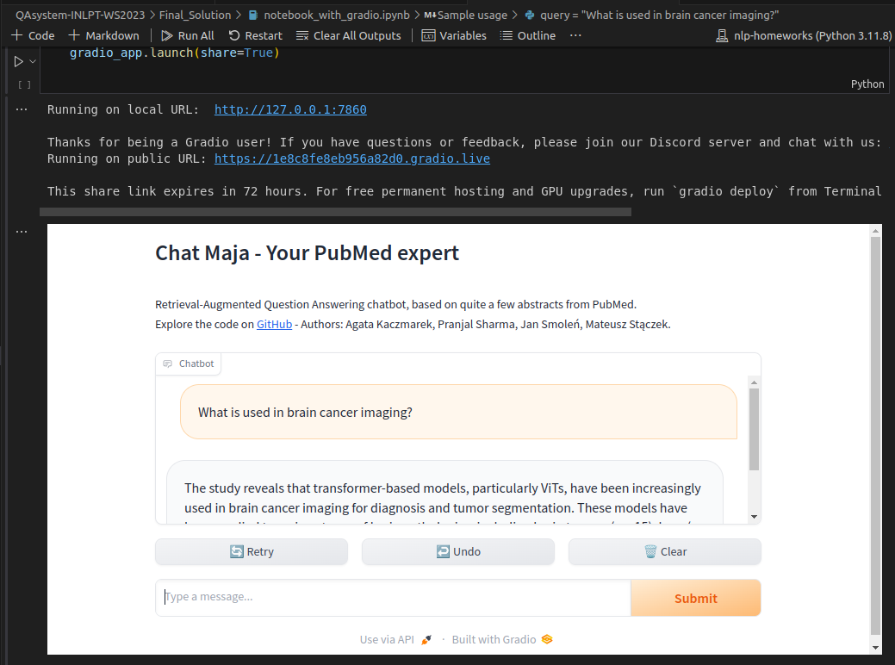
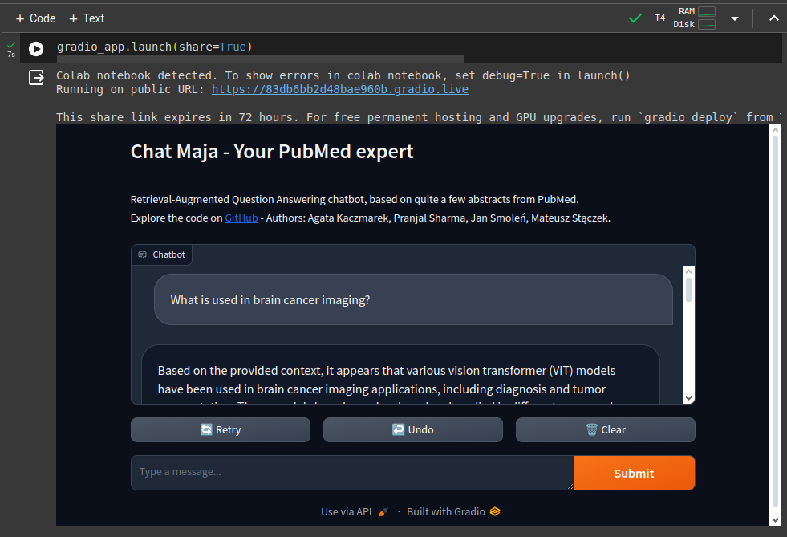

# ChatMaJA - how to run our QA system

Contains:
- `requirements.txt` - Python packages required to run our code locally, with CUDA support.
- `data/` - contains raw and preprocessed data,
- `data_preparation.py` - script to transform raw data into preprocessed data
- `Docker_Flask_App` - Docker app with our own Flask UI
- `notebook_with_gradio.ipynb` - contains same pipeline as the Docker app, but can be run in Collab with GPU, greatly improving user experience and performance.

## Environment and requirements

OS tested: Ubuntu 22.04

Docker version: 25.0.3 (only used for Flask UI)

Python tested: 3.11.8

All Python requirements are located in the `requirements.txt` file and can be installed with

```bash
pip install -r requirements.txt
```

## Data

We obtained our data from PubMed in a few manual steps. After obtaining `.xslx` files, we use Python to create a single CSV for a desired number of articles split into chunks.

### Obtaining data from PubMed - manual steps

1. Manually download IDs of articles from PubMed (PMIDs) for selected query and time range:

    Open PubMed -> search for keyword "Intelligence" -> select year range 2013-2023 -> download list of PMIDS.

    Due to PubMed's limitation of the maximum number of IDs downloaded at once, the downloading of all IDs has to be done in parts, for different time ranges. Should there be an overlap in time ranges, deduplication of IDs is also done at this step.

2. Use a website [pubmed2xl.com](pubmed2xl.com) to download `.xlsx` with abstracts and other metadata of articles based on their PubMed ID:

    Go to [pubmed2xl.com](pubmed2xl.com) -> input PMIDs -> download the abstract, title, and all other information for papers with these IDs.

In-depth description with intermediate files can be found in this repository in `QAsystem-INLPT-WS2023/Previous_Work/Phase1-Planning&DataGathering/README.md`

### Transforming xlsx to CSV

To preprocess data from gathered `.xlsx` format and create a CSV, run:

```bash
python data_preparation.py
```

By default, it processes only first 100 abstracts. Change a variable in the beginning from `number_of_first_rows = 100` to `-1` to process all abstracts (might take a while).

Output is saved to `data/preprocessed_data` and is named according to the number of articles processed.

## UI

From the technical point of view, our solution includes two variants of UI, but both use the same backend system described below. The first front-end was developed in Flask, the other UI uses a ready Gradio template. For Flask version we need to build a standalone Docker container, but the UI is written by us. In our solution, Gradio is the recommended version, as it is faster (because run on GPU) and it showcases the possibility of live-streaming the model's output to the UI. 

Example of our Gradio UI, streaming model output to the user:




### Local Docker + simple Flask (CPU)

This version of UI works on CPU only and is easily available by building and running a standalone Docker container. Below there is a screenshot of working UI. The detailed description about the Docker container can be found in README.md in directory `Docker_Flask_App`.



#### How to run - with Docker Compose

> **Note:** commands below assume you're in the directory `QAsystem-INLPT-WS2023/Final_Solution/Docker_Flask_App` with the `Dockerfile.base`, `Dockerfile` and `docker-compose.yaml` files.

Build an image with the environment and run docker compose up (which automatically will build an image with the app):

```bash
docker build -t chatmaja_base:v1 -f Dockerfile.base .
docker compose up
```

Then, open http://localhost:5000/.

##### Two version of CSV files

We prepared 2 datasets - one with chunks from 100 abstracts, and the other with chunks from all abstracts. Loading all chunks to LanceDB requires computing embeddings and takes a very long time on CPU (but works). Either run on a tiny subset of data or download a ready database.

> Options:
> > Update `docker-compose.yml` to use a smaller dataset.
> 
> OR
> 
> > Download and extract a ready LanceDB database `db` folder and place it in the same directory as `docker-compose.yml` - [download link](https://wutwaw-my.sharepoint.com/:f:/g/personal/01151437_pw_edu_pl/EnwtlXrMPApNlDmptSaLnQEBYF_-Bxe7xUs47pqBqQhBYg?e=DCKSDy).

> **For best answers, use all abstracts and download the precomputed LanceDB database.**

> **Note**: read the readme in `QAsystem-INLPT-WS2023/Final_Solution/Docker_Flask_App` to learn, how to download precomputed LanceDB embeddings.

### Gradio notebook (with GPU, on Colab too) - recommended

For better performance and user experience, use UI variant with Gradio in Jupyter Notebook (can be run on Collab with GPU):

Below there is a screenshot of working UI, opened in a separate browser card:



and a screenshot of Gradio directly in Jupyter Notebook:



and finally a screenshot of Gradio directly in Colab, with T4 GPU:



#### How to run - Gradio notebook

Simply open the Jupyter notebook `notebook_with_gradio.ipynb` in the `Final_Solution` folder and run all cells. The Gradio UI will be available both in Jupyter Notebook and at http://localhost:7860/.

To run on Colab, you need to upload requirements:
- `QAsystem-INLPT-WS2023\Final_Solution\requirements.txt`

and data, either the whole dataset or a sample:

- sample:  `QAsystem-INLPT-WS2023\Final_Solution\data\preprocessed_data\master_without_embeddings_first_100.csv`,
- whole: `QAsystem-INLPT-WS2023\Final_Solution\data\preprocessed_data\master_without_embeddings_all.csv`.

Remember to set the correct paths to those files (in first cell to install all requirements and later, set `path_to_data_csv` to point to the CSV file).

The Gradio UI will be available both in Colab, and at a printed URL.

Using Huggingface Spaces is a clean way to deploy the app BUT free tier performance is unusable (~10 minutes of initial waiting time and then 4 letters per 10 seconds). And we wanted to create our system for free.

#### Gradio - download precomputed LanceDB embeddings

Loading whole dataset to LanceDB takes more than 5 minutes on T4 Colab GPU. We provide a ready LanceDB database `db` folder to download. Extract it to create a folder `db` in the same directory as `notebook_with_gradio.ipynb` - [download link](https://wutwaw-my.sharepoint.com/:f:/g/personal/01151437_pw_edu_pl/EnwtlXrMPApNlDmptSaLnQEBYF_-Bxe7xUs47pqBqQhBYg?e=DCKSDy).

> **For best answers, use all abstracts and download the precomputed LanceDB database.**
